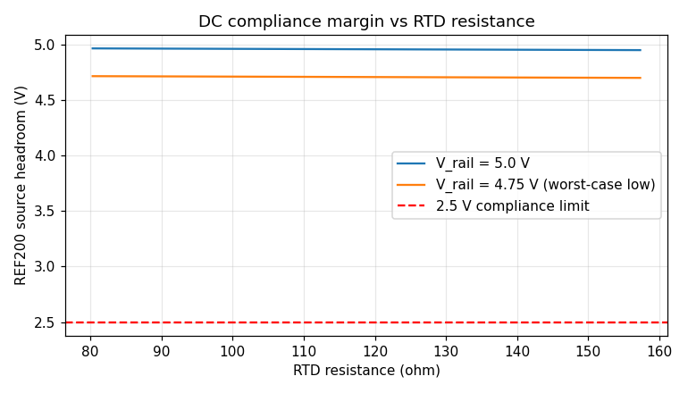

# DC operating point & compliance margin — 2026-06-22 — sim

> Auto-generated by `sim/scripts/run_all.py` (preset `pt100_200u`). Do not hand-edit;
> regenerate with `python sim/scripts/run_all.py`.

## Objective
Confirm every REF200 section keeps enough voltage across it to regulate (>= 2.5 V) across the full RTD range and worst-case supply. Maps to TESTING_PLAN test 1.

## Setup
Deck 01_dc_op.cir. Unit cell at V_rail = 5.0 V (nominal) and 4.75 V (worst-case low). RTD swept 80.3..157.3 ohm.

## Method
DC sweep of RTD; headroom = v(rail) - v(top of R_ref).

## Results

| Quantity | Expected | Measured | Unit |
|----------|----------|----------|------|
| V_RTD range | 8.0-15.7 mV | 16.08-31.50 mV |  |
| V_ref | 20.0 mV | 20.020 mV |  |
| min headroom (nominal) | >= 3 V | 4.948 V |  |
| min headroom (low supply) | >= 2.5 V | 4.698 V |  |

## Pass / Fail
**Criterion:** Source headroom >= 2.5 V (target >= 3 V) at max RTD R and min supply.

**Result: PASS** — min source headroom = 4.698 V (limit 2.5 V) -> PASS

## Anomalies & notes
Headroom is enormous because the total burden voltage I*(R_ref+R_RTD) is only ~26 mV. Even a 3.3 V rail would pass.

## Next
—
