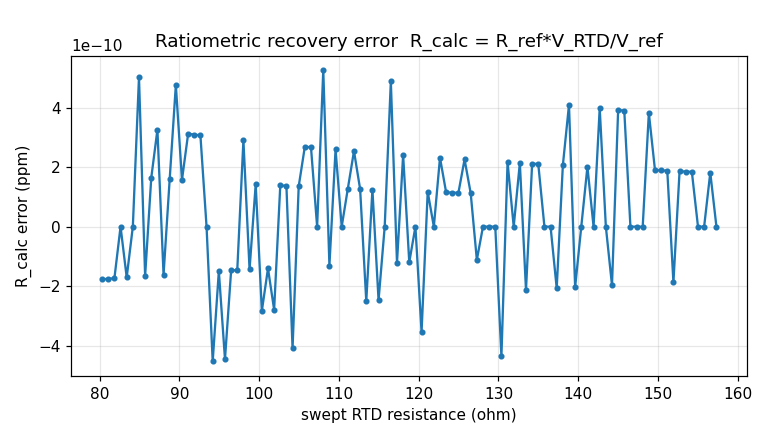

# Ratiometric correctness (sanity) — 2026-06-22 — sim

> Auto-generated by `sim/scripts/run_all.py` (preset `pt100_200u`). Do not hand-edit;
> regenerate with `python sim/scripts/run_all.py`.

## Objective
Prove the topology: R_calc = R_ref*V_RTD/V_ref recovers the RTD value independent of the source current and of the finite source output resistance. TESTING_PLAN test 2.

## Setup
Deck 02_ratiometric.cir, tight solver tolerances (reltol 1e-12).

## Method
DC sweep RTD; compute R_calc from solved node voltages; compare to the swept value.

## Results

| Quantity | Expected | Measured | Unit |
|----------|----------|----------|------|
| max |error| | ~0 (numerical) | 5.262e-10 ppm |  |
| error at R=R0 | ~0 | -2.83e-10 ppm |  |

## Pass / Fail
**Criterion:** R_calc == swept RTD to within numerical error (< 1 ppm).

**Result: PASS** — max |R_calc - R_RTD| = 5.262e-10 ppm (< 1.0 ppm) -> PASS

## Anomalies & notes
Residual is pure Newton/solver tolerance, not model error: the same series current flows through R_ref and the RTD, so the ratio is exact regardless of I or R_out. This is the architectural guarantee that the REF200's absolute accuracy and drift drop out of the result.

## Next
—
