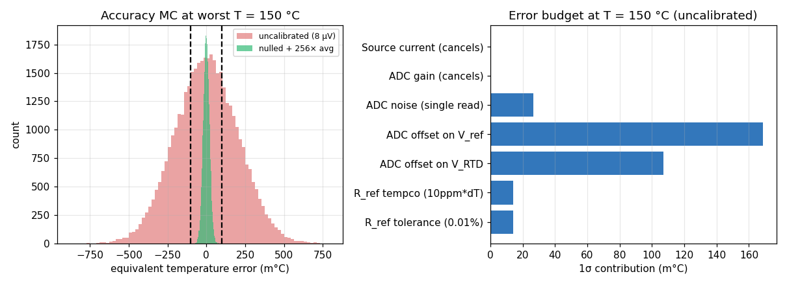

# Accuracy / Monte-Carlo -> equivalent °C error — 2026-06-22 — sim

> Auto-generated by `sim/scripts/run_all.py` (preset `pt100_200u`). Do not hand-edit;
> regenerate with `python sim/scripts/run_all.py`.

## Objective
THE key deliverable: propagate R_ref tolerance+tempco and T7 ADC offset/gain/noise to an equivalent temperature error in °C for the chosen RTD. TESTING_PLAN test 3.

## Setup
Deck 03_accuracy_rref.cir (SPICE sensitivity cross-check) + montecarlo_accuracy() N=40000, two scenarios (raw single-read T7 offset vs per-channel offset nulled + 256× averaging). Preset pt100_200u: Pt100, I=200 µA, R_ref=100.0 Ω, V_ref=20 mV, T7 ±0.1 V range.

## Method
SPICE: sweep actual R_ref over ±(tol+tempco) at R0, recover with nominal R_ref. MC: sample all error sources, recover R, invert via Callendar-Van Dusen, take dT distribution at five temperatures; report 99.7%|dT|.

## Results

| Quantity | Expected | Measured | Unit |
|----------|----------|----------|------|
| SPICE: d(err)/d(R_ref frac) | -1e6 ppm/frac | -1e+06 ppm/frac |  |
| R_ref-only floor (1σ) | < 40 m°C | 19.9 m°C |  |
| ADC offset term (1σ, V_RTD) | — | 107.1 m°C |  |
| ADC offset term (1σ, V_ref) | — | 168.5 m°C |  |
| total 99.7% (raw, single read) | <= 100 m°C | 608 m°C |  |
| total 99.7% (nulled + 256× avg) | <= 100 m°C | 58.7 m°C |  |
| max raw offset for ±0.1 °C | — | 1.3 µV |  |

## Pass / Fail
**Criterion:** Total equivalent error within ±0.1 °C, dominated by R_ref. (Finding: at 100 µA it is dominated by ADC OFFSET unless nulled.)

**Result: CONDITIONAL (see recommendation)** — R_ref floor 20 m°C; meets ±100 m°C with offset-null + 256× avg (59 m°C) but NOT raw single-read (608 m°C)

## Anomalies & notes
**Dominant term (raw): ADC offset on V_ref** (168 m°C 1σ). At 200 µA the signals are only ~20 mV, so the T7 ADC OFFSET — not R_ref — sets the budget. Ratiometric cancels gain AND source current (those budget rows are 0), but it does NOT cancel ADC offset: V_RTD and V_ref are read on separate AIN pairs with independent offsets, and averaging reduces NOISE not OFFSET.

- **R_ref-limited floor = 20 m°C** — well under ±0.1 °C, confirming the spec's sanity check for the reference-resistor term.
- **Uncalibrated (8 µV assumed): 608 m°C (99.7%) — FAILS ±0.1 °C.**
- **Per-channel offset nulling + 256× averaging (recommended mode): 59 m°C — PASSES**, and R_ref again dominates.

To meet ±0.1 °C without nulling, the per-read offset must be ≤ ~1.3 µV (1σ). t7_offset is a CONFIG ASSUMPTION (8 µV) — verify against the T7 datasheet for the ±0.1 V range.

## Next
MANDATORY: add per-channel ADC offset nulling to the bench plan (measure each AIN pair with input shorted / known zero; subtract). Verify the T7 differential offset spec. If offset cannot be nulled below ~1 µV, switch to 200 µA (Mode A) — it doubles the signals and halves the offset-referred error.
