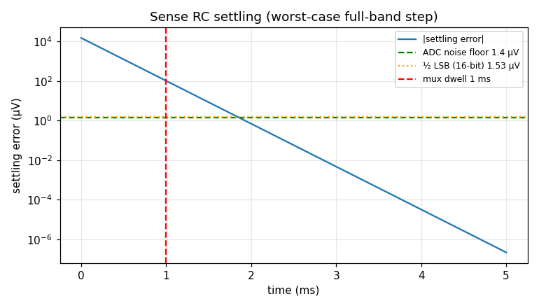

# Transient — sense RC settling vs mux dwell — 2026-06-22 — sim

> Auto-generated by `sim/scripts/run_all.py` (preset `pt100_200u`). Do not hand-edit;
> regenerate with `python sim/scripts/run_all.py`.

## Objective
Size the sense RC filter and scan rate together: confirm a channel settles to < ½ LSB within the mux dwell. TESTING_PLAN test 5.

## Setup
Deck 05. Differential filter 2×1000 Ω + 0.10 µF (τ = 200 µs). Worst-case step 15.40 mV (max→min sense voltage). Cap pre-charged to the previous channel via .ic.

## Method
Transient relaxation from the worst-case previous-channel voltage to this channel's V_RTD; settling time = when |error| stays below the threshold.

## Results

| Quantity | Expected | Measured | Unit |
|----------|----------|----------|------|
| filter τ (differential) | — | 200 µs |  |
| settle to noise floor | <= 1 ms | 1.86 ms |  |
| settle to ½ LSB | <= 1 ms | 1.85 ms |  |
| required C for 1 ms (shared) | — | 54 nF |  |

## Pass / Fail
**Criterion:** Settle below ½ LSB / ADC noise floor within the mux dwell (1 ms).

**Result: CONDITIONAL (see recommendation)** — worst-case settle to noise floor = 1.86 ms vs 1 ms dwell -> EXCEEDS dwell (mitigated by per-channel RC placement)

## Anomalies & notes
FINDING: if the 0.1 µF cap must RE-SETTLE a full inter-channel step every mux hop (i.e. a single SHARED filter after the T7 mux), settling needs ~1.9 ms — it EXCEEDS the 1 ms dwell. Mitigations: (a) RECOMMENDED — place the RC PER SENSE PAIR before the mux (board_spec §6 'at the T7 input', one R+C per channel); each cap then stays charged at its channel's voltage and never re-settles, so the only settling is the T7's own input mux (datasheet, ~tens of µs). (b) Shared filter: use C ≤ ~54 nF, or (c) lengthen the dwell to ≥ 1.9 ms, or (d) accept lower resolution. This is a LAYOUT REQUIREMENT for Track F: per-channel sense RC, not a single shared one. Effective-bits (16) is an assumption — confirm against the T7 resolution-index table.

## Next
Track F: one RC per sense pair, placed before the T7 mux. Bench Stage 6: verify per-channel settling at the chosen ResolutionIndex.
