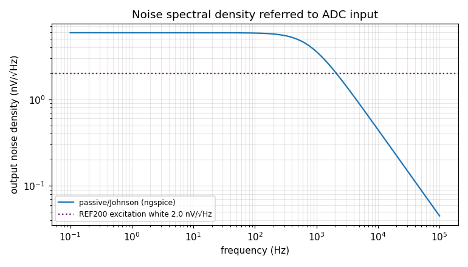

# Noise — excitation + passive chain vs ADC floor — 2026-06-22 — sim

> Auto-generated by `sim/scripts/run_all.py` (preset `pt100_200u`). Do not hand-edit;
> regenerate with `python sim/scripts/run_all.py`.

## Objective
Confirm the excitation + passive chain noise sits below the T7 ADC floor — the architecture must not introduce a new noise source. TESTING_PLAN test 6.

## Setup
Deck 06_noise.cir `.noise` 0.1 Hz–100 kHz, output v(adcp,adcn). Filter ENBW ≈ 1250 Hz. Excitation noise added from datasheet.

## Method
ngspice integrates Johnson noise of R_ref, RTD, R_out and the two filter resistors through the cap; analysis adds REF200 white (20 pA/√Hz) and flicker (1 nA p-p) current noise × R in quadrature.

## Results

| Quantity | Expected | Measured | Unit |
|----------|----------|----------|------|
| passive/Johnson (ngspice) | — | 203 nV |  |
| excitation white ×R | — | 70.7 nV |  |
| excitation flicker ×R | — | 15.2 nV |  |
| total chain noise | < 1.4 µV | 216 nV |  |
| signal V_ref | — | 20 mV |  |
| chain noise / ADC floor | < 1 | 0.15 |  |

## Pass / Fail
**Criterion:** Total RMS noise referred to ADC input < T7 ADC noise floor.

**Result: PASS** — total 216 nV RMS vs ADC floor 1.4 µV -> PASS

## Anomalies & notes
Chain noise is ~6× below the ADC floor and ~9.28e+04× below the signal. The excitation is NOT the limiter — the architecture targets the real problem (CMRR/series stacking) without adding noise. The flicker term cancels ratiometrically (slow common drift on I).

## Next
—
