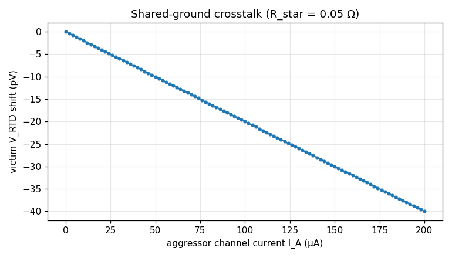

# Crosstalk via shared star-ground — 2026-06-22 — sim

> Auto-generated by `sim/scripts/run_all.py` (preset `pt100_200u`). Do not hand-edit;
> regenerate with `python sim/scripts/run_all.py`.

## Objective
Bound coupling between channels through a finite shared star-ground return, and set the acceptable star-ground trace resistance. TESTING_PLAN test 7.

## Setup
Deck 07. Two cells sharing R_star = 0.05 Ω. Aggressor current swept 0→200 µA; victim read Kelvin-differential.

## Method
DC sweep of aggressor current; record victim V_RTD shift (computed in double precision in-SPICE). Coupling scales linearly with R_star.

## Results

| Quantity | Expected | Measured | Unit |
|----------|----------|----------|------|
| victim shift @ full I_A | < 1.4 µV | 40.00 pV |  |
| equivalent °C error | negligible | 0.51 µ°C |  |
| max acceptable R_star | — | 1750 Ω |  |

## Pass / Fail
**Criterion:** Coupling into the victim below the ADC noise floor for the planned R_star.

**Result: PASS** — coupling = 40.0 pV = 0.51 µ°C at R_star=0.05 Ω -> PASS

## Anomalies & notes
Differential Kelvin sensing rejects the star-ground bump itself (common-mode); the only residual is the second-order path dV/dI_A = R_star·R_RTD/R_out = 0.2 µΩ-per-... i.e. 40.0 pV at full current. The star-ground resistance could be ~1750 Ω before crosstalk reached the ADC floor — so the star-ground requirement is trivially met. This is the architecture's whole point: independent loops + Kelvin make position/channel coupling vanish.

## Next
—
