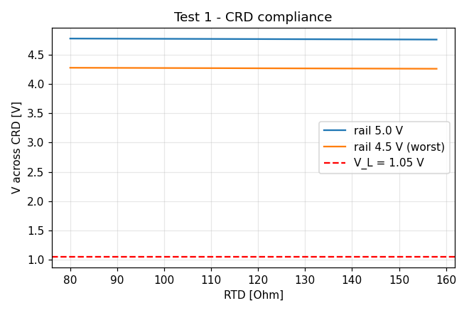

# Test 1 - DC operating point & CRD compliance — 2026-06-22 — sim

## Objective
Acceptance (a): the CRD keeps regulating (V across it > V_L) across the full Pt100 sweep at the worst-case low rail.

## Setup
Deck sim/netlists/test1_dc_compliance.cir; ngspice op sweep of Vrrtd 80-158 Ohm at rail = 5.0 V and 4.5 V; CRD = 220 uA || 5 MOhm.

## Method
Vcrd = v(rail)-v(top) over the sweep; take the minimum at the low rail and compare to V_L.

## Results
| quantity | expected | measured | unit |
|---|---|---|---|
| min V across CRD (rail 4.5 V) | > 1.05 | 4.264 | V |
| margin above V_L | > 0 | 3.214 | V |
| V_RTD span (Pt100) | 18-35 | 17.7-34.9 | mV |

## Pass / Fail
Criterion min Vcrd > V_L=1.05 V. **PASS** (margin 3.21 V).

## Next
Re-point at the exported KiCad netlist in Wave 3.
