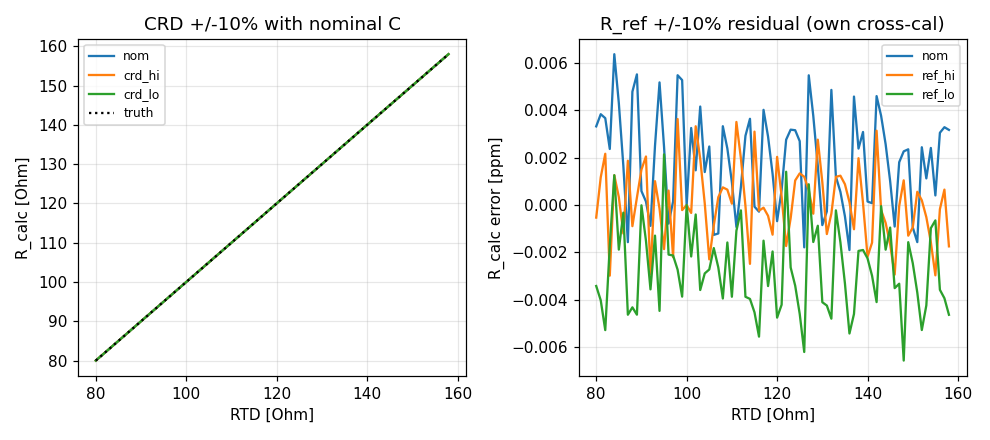

# Test 2 - Ratiometric + cross-cal correctness — 2026-06-22 — sim

## Objective
Acceptance (b): R_calc = C*V_RTD/V_ref recovers the swept RTD and is invariant to +/-10% CRD and R_ref perturbation.

## Setup
Deck test2_ratio_xcal.cir; Vrrtd 80-158 Ohm at five (kc,kref) corners.

## Method
CRD spread checked with the NOMINAL C (proves live current cancellation); R_ref spread checked with each corner's own cross-cal (proves the value is absorbed into C).

## Results
| case | applied C | max |R_calc-RTD|/RTD |
|---|---|---|
| CRD +/-10% | nominal (no recal) | 7.51e-09 |
| R_ref +/-10% | per-corner recal | 6.56e-09 |

## Pass / Fail
Criterion max error < 1e-06. **PASS** (CRD 7.5e-09, R_ref 6.6e-09 -> numerical floor).

## Next
Bench Stage 2/3 repeats this with real parts.
