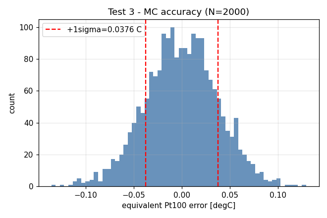

# Test 3 - Monte-Carlo accuracy -> degC error — 2026-06-22 — sim

## Objective
Acceptance (c): over board dT the accuracy is dominated by R_ref tempco + relative ADC gain tempco, within target.

## Setup
Deck test3_montecarlo.cir; N=2000 Gaussian samples; dT=10 C; sigmas R_ref/gain=10/10 ppm/C, offset=1 uV; cross-cal C verified = R_ref0 = 910 Ohm.

## Method
Per sample: cross-cal at dt=0, then op at dt with sampled tempco/offset; fractional error -> Pt100 degC via x255.9.

## Results
| term | 1-sigma input | degC (1-sigma) |
|---|---|---|
| R_ref tempco | 10 ppm/C | 0.0256 |
| relative ADC gain tempco | 10 ppm/C | 0.0256 |
| V_RTD offset drift | 1 uV | 0.0116 |
| **analytic RSS** | | **0.0380** |
| **MC sigma (sim)** | | **0.0376** |
| MC 95th pct \|err\| | | 0.0731 |

## Pass / Fail
Criterion sigma <= 0.05 C AND tempco terms dominate. **PASS** (sigma=0.0376 C; each tempco term 0.0256 C > offset 0.0116 C).

## Anomalies & notes
Offset term scales as 1/V_RTD (~22 mV), so it is the term most sensitive to the small Pt100 signal - tighten T7/ADS offset drift or recal more often if it grows.

## Next
Inject real part tempco/offset specs; bench Stage 7 measures C drift.
