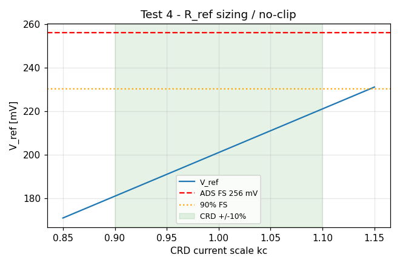

# Test 4 - R_ref sizing / no-clip vs ADS1115 range — 2026-06-22 — sim

## Objective
Acceptance: worst-case V_ref stays under the ADS1115 +/-0.256 V range with margin and good effective bits.

## Setup
Deck test4_rref_sizing.cir; R_ref=910 Ohm; sweep CRD scale kc 0.85-1.15.

## Method
V_ref = drop across R_ref (RTD-independent); evaluate at kc=1.10 (+10% CRD) and compare to 90% of full scale.

## Results
| quantity | expected | measured | unit |
|---|---|---|---|
| V_ref at +10% CRD | < 230 | 221.1 | mV |
| fraction of ADS FS | < 90 | 86.4 | % |
| effective bits used | high | 14.8 | bits |

## Pass / Fail
Criterion V_ref(+10%) < 90% FS. **PASS** (86% FS).

## Next
If headroom is wanted, R_ref=1k on the +/-0.512 V range.
