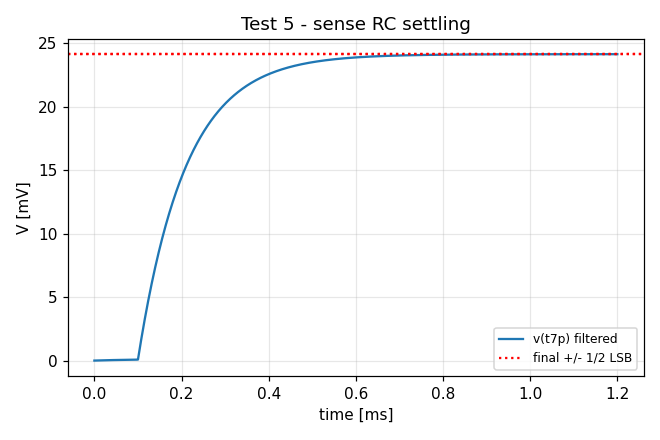

# Test 5 - Sense-line RC settling vs mux dwell — 2026-06-22 — sim

## Objective
Acceptance: the 1 kOhm/0.1 uF sense filter settles to < 1/2 T7 LSB within the per-channel mux dwell.

## Setup
Deck test5_transient_settle.cir; CRD switched on at t=100 us; RF=1 kOhm, CF=0.1 uF; .tran to 1.2 ms.

## Method
Find the last time the filtered node is outside final +/- 1/2 LSB; compare that settle time to the mux dwell.

## Results
| quantity | expected | measured | unit |
|---|---|---|---|
| RC time constant | ~100 | 100 | us |
| settle to 1/2 LSB (1 uV) | < 5 | 1.03 | ms |
| mux dwell budget | - | 5 | ms |

## Pass / Fail
Criterion settle < dwell. **PASS** (settle 1.03 ms < 5 ms).

## Next
Confirm the chosen scan dwell on the T7 in Track C / bench.
