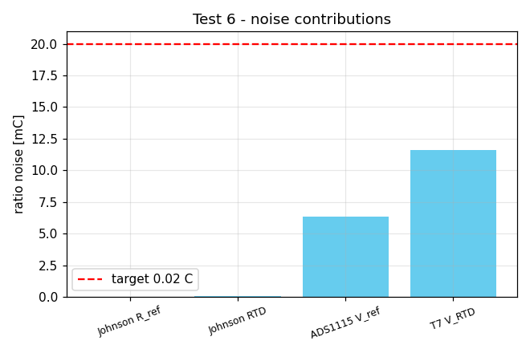

# Test 6 - Noise of the ratio — 2026-06-22 — sim

## Objective
Acceptance (d): ratio noise below the per-channel resolution target, with the CRD current-noise risk explicitly bounded.

## Setup
ngspice .noise -> Johnson PSD (V_ref 3.88, V_RTD 1.29 nV/rtHz); BW=10 Hz; T7 1 uV, ADS 5 uV RMS (assumed).

## Method
RSS-combine each path's noise, divide by its signal (V_ref=201 mV, V_RTD=22.1 mV), RSS the two fractions, x255.9 -> degC. CRD noise is common to both reads: it CANCELS in the ratio under simultaneous sampling; the bound is the i_n that would reach target if it did NOT.

## Results
| source | contribution [degC RMS] |
|---|---|
| Johnson R_ref | 0.0156 m |
| Johnson RTD | 0.0471 m |
| ADS1115 V_ref | 6.3648 m |
| T7 V_RTD | 11.5776 m |
| **total (Johnson+ADC)** | **13.212 m** |
| CRD current-noise bound (worst case) | 2.90 nA/rtHz |

## Pass / Fail
Criterion total < 0.02 C. **PASS** (13.21 mC). CRD bound 2.9 nA/rtHz worst-case; ~0 if T7/ADS sample simultaneously.

## Anomalies & notes
T7/ADS noise are assumptions - replace with datasheet/bench. Johnson is negligible; the ADCs dominate.

## Next
Bench Stage 5 (noise/position) and Stage 8 (CRD noise) confirm.
