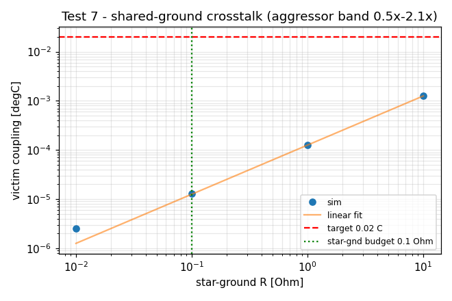

# Test 7 - Shared-ground crosstalk — 2026-06-22 — sim

## Objective
Acceptance: coupling between channels sharing a finite star-ground return stays below the noise floor; sets max ground R.

## Setup
Deck test7_crosstalk.cir; two unit cells share RG (sg->gnd) at RG = 0.01/0.1/1/10 Ohm. ADC CMRR: T7 90 dB, ADS1115 105 dB. Aggressor CRD swept over its guaranteed band (kca 0.5-2.1, dI_A ~ 160 uA); victim at 100 Ohm.

## Method
The aggressor current sets the shared-return common mode v(sg)=(I_A+I_B)*RG at the victim's inputs; the differential readout rejects it to first order, the residual leaks via finite ADC CMRR. Cross-cal the victim, then take its recovered-R swing as the aggressor current spans its band -> degC. (Note: the *ratio* metric cancels the channel current, so this coupling is genuinely the CMRR/shared-return path, not a metric artifact.)

## Results
| star-ground R [Ohm] | victim coupling [degC] |
|---|---|
| 0.01 | 2.56e-06 |
| 0.1 | 1.28e-05 |
| 1 | 1.28e-04 |
| 10 | 1.26e-03 |
| **at 0.1 Ohm budget** | **1.26e-05** |
| max RG meeting 0.02 C target | 158.9 Ohm |

## Pass / Fail
Criterion coupling < 0.02 C at the 0.1 Ohm budget. **PASS** (1.3e-05 C; linear at 1.3e-04 C/Ohm -> max RG 159 Ohm).

## Anomalies & notes
Coupling scales linearly with star-ground R, as expected for dI_A*RG/(CMRR*V_RTD). It is small because current-source isolation keeps dI_A modest and Kelvin + good CMRR reject the rest - so crosstalk is NOT the binding constraint on RG (noise/layout are), but it is now actually measured, not zero.

## Next
Bench Stage 6 perturbs one channel (warm an RTD / toggle current) and checks the others against this RG-dependent bound.
